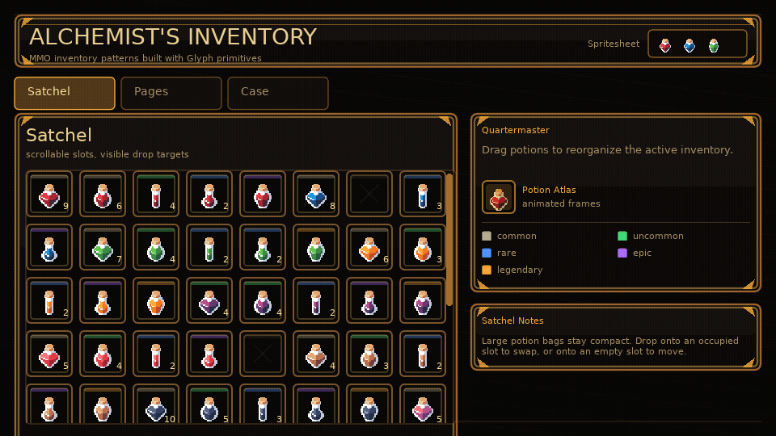

# glyph.lua

Declarative UI for Love2D 11.x, shaped for game HUDs, debugger panels, editor
tools, and in-game menus.

Glyph is a small UI engine for games: layout, styling, input, animation,
feedback, scenes, accessibility metadata, and game-friendly drawing primitives
live in core; game-specific widgets stay in examples or app code.

## Documentation

Read the public docs at <https://kyonru.github.io/glyph.lua/>.

The same documentation lives locally in [docs/](docs/README.md).

## Preview

<!-- glyph:feature-gif inventory-drag-drop -->

<!-- /glyph:feature-gif inventory-drag-drop -->

## Quick Start

```lua
local ui = require("glyph")

local function App()
  local count, setCount = ui.useState(0)

  return ui.panel({ title = "Mission Console", width = 360, padding = 12, gap = 10 }, {
    ui.row({ gap = 8, align = "center" }, {
      ui.button({
        label = "Increment",
        onClick = function()
          setCount(count + 1)
        end,
      }),
      ui.text("Count: " .. tostring(count)),
    }),
  })
end

function love.update(dt)
  ui.update(dt)
end

function love.draw()
  ui.render(App)
end
```

Copy `glyph.lua` and the `glyph/` directory into a Love2D project, then:

```lua
local ui = require("glyph")
```

Glyph has no required runtime dependency beyond Love2D 11.x. Optional adapters
such as Push/Shove viewport backends, SYSL rich text, and anim8 sprite
animations are app-provided.

## Examples

Run an example with Love2D:

```sh
love examples/basic
love examples/inventory
love examples/path-feedback
```

See the full examples guide in [docs/examples.md](docs/examples.md).

## Development

Run tests:

```sh
make test
# or directly
.luarocks/bin/busted
```

Syntax-check Lua files:

```sh
luac -p glyph.lua glyph/*.lua examples/*/main.lua examples/*/example.lua spec/*_spec.lua
```

Serve the docs locally:

```sh
make docs
```
