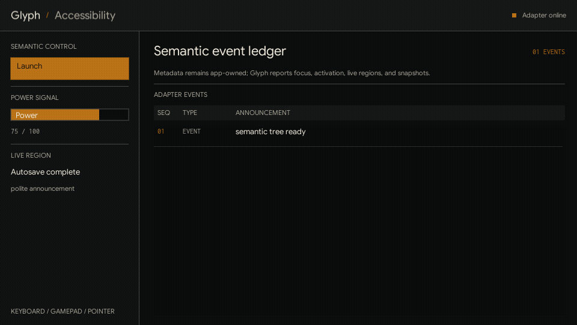

# Accessibility

<!-- glyph:feature-gif accessibility -->

<!-- /glyph:feature-gif accessibility -->

> [!TIP]
> See it in action: [`examples/accessibility`](examples.md) demonstrates semantic
> labels, focus events, live announcements, and snapshots.

Glyph runs inside Love2D, so it cannot magically turn nodes into native OS
screen-reader controls. Instead, Glyph exposes semantic metadata, focus and
activation announcements, live-region events, and tree snapshots. Your app can
log those events, speak them with a TTS library, bridge them to platform APIs, or
publish them to DOM live regions in Love.js.

## Semantic Props

Every node accepts semantic props:

```lua
ui.button({
  label = "Launch",
  role = "button",
  accessibilityLabel = "Launch mission",
  accessibilityDescription = "Starts the selected mission",
})
```

Useful props:

- `role`: `"button"`, `"text"`, `"input"`, `"panel"`, `"tab"`, `"meter"`, `"dialog"`, `"group"`, `"none"`, or an app-defined string.
- `accessibilityLabel`: the short name announced for the node.
- `accessibilityDescription`: supporting context.
- `accessibilityValue` / `accessibilityValueText`: numeric and spoken values for meters, sliders, inputs, or custom controls.
- `accessibilityHidden = true`: hides decorative nodes from snapshots and announcements.
- `accessibilityLive = "polite"` or `"assertive"`: announces resolved text/value changes after the initial build.

Use `role = "none"` for purely structural nodes that should not appear in the
semantic tree.

### Tab Selection

Semantic tabs expose a structured `selected` boolean. `ui.tabs` derives it from
the generated tab button's existing `active` state, so both active and inactive
tabs are explicit in descriptions and snapshots. Other roles leave `selected`
unset, even when they use `active` for visual styling.

Focus and activation events forward the same `selected` field. Glyph does not
append selected/unselected wording to `message`; adapters remain responsible for
speech, logging, or platform-specific state announcements.

## I18n Keys

Semantic strings support the same keyed pattern as labels and placeholders:

```lua
ui.meter({
  value = hp,
  max = 100,
  labelKey = "hud.hp",
  labelParams = { value = hp },
  labelCacheKey = "hp:" .. hp,
  accessibilityLabelKey = "hud.hp.label",
  accessibilityValueTextKey = "hud.hp.value",
  accessibilityValueTextParams = { value = hp },
  accessibilityValueTextCacheKey = "hp-value:" .. hp,
})
```

Glyph resolves semantic keys through `ui.i18n.t` before layout, snapshots, and
runtime events use the strings.

## Events

Register an adapter with the normal callback bus:

```lua
local off = ui.on("accessibility", function(event)
  print(event.kind, event.message)
end)
```

Events include `kind`, `message`, `node`, `path`, `role`, `label`,
`description`, `valueText`, `live`, and tab `selected` state.

Glyph emits:

- `focus`: when focus moves to a semantic node.
- `activate`: when a button activates by mouse, touch, keyboard, or mapped gamepad input.
- `live`: when a live region's resolved text/value changes after the first build.
- `announce`: when your app calls `ui.accessibility.announce`.

## Configuration

```lua
ui.accessibility.configure({
  enabled = true,
  announceOnFocus = true,
  announceOnActivate = true,
})
```

`configure({})` restores the defaults. When disabled, Glyph still stores semantic
props, but it does not emit accessibility events.

Manual announcements are app-owned:

```lua
ui.accessibility.announce("Autosave complete", {
  kind = "live",
  live = "polite",
})
```

## Snapshots

`ui.accessibility.snapshot(root?)` returns semantic nodes in layout/draw order.
Without a root, it snapshots the active runtime root and scene layers.

```lua
for _, item in ipairs(ui.accessibility.snapshot()) do
  print(item.role, item.label, item.valueText, item.selected)
end
```

`ui.accessibility.focused()` returns the current focused semantic description.
`ui.accessibility.describe(node)` normalizes one node.

## Love2D Boundaries

Glyph does not play speech, load voices, expose native UI controls, handle OS
accessibility preferences, shape bidirectional text, or enforce WCAG rules. The
core provides consistent semantics and events; apps own the adapter and policy.

> [!TIP]
> Keyboard navigation and the opt-in gamepad mapper both use Glyph focus and
> activation, so they naturally produce the same accessibility focus and
> activate announcements as pointer interaction.
