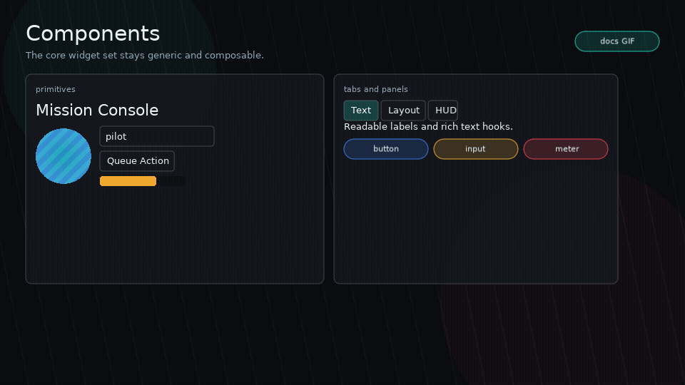

# Components

<!-- glyph:feature-gif components -->

<!-- /glyph:feature-gif components -->

> [!TIP]
> See it in action: [`examples/basic`](examples.md) wires up text, buttons,
> inputs, meters, tabs, and a scroll view end to end.

Glyph components return virtual nodes. Components are plain Lua functions; there is no class system.

## Text

```lua
ui.text("Hello", {
  wrap = true,
  width = 240,
  textStyle = "paragraph",
  style = { color = { 1, 1, 1, 1 } },
})
```

Use `wrap = true` with a known width for text that may overflow.
Use `textStyle` to select a theme typography preset such as `h1`, `h2`,
`paragraph`, `caption`, or `code`. Convenience helpers set that prop for you:

```lua
ui.h1("Mission Briefing")
ui.h2("Objectives")
ui.p("Hold the zone until extraction.")
ui.caption("Autosaved 4 seconds ago")
```

Rich/game text is opt-in with `ui.richText`, which uses the configured SYSL-Text
backend when available:

```lua
ui.richText("Status: [color=#7cffae]online[/color] [font=mono]stable[/font]", {
  wrap = true,
  width = 320,
  height = 64,
  textVerticalAlign = "center",
})
```

`ui.richText(value, props)` is sugar for `ui.text(value, { format = "sysl" })`.
On a plain `ui.text`, `rich = true` is the same shorthand (`format = "sysl"`); an
explicit `format` always wins.

`textVerticalAlign = "top" | "center" | "bottom"` offsets plain or SYSL-backed
text inside an explicit text node height. It is visual-only and does not change
layout, hit testing, or focus geometry.

Configure the backend with an app-provided SYSL module:

```lua
ui.richTextBackend.configure({
  sysl = require("slog-text"),
  defaults = { font = love.graphics.getFont() },
  configure = function(Text)
    Text.configure.font_table({ mono = monoFont })
  end,
})
```

Glyph disables SYSL function commands after configuration by default. Apps that
intentionally want scripting tags should own that risk in app code.
The typography example uses a development copy from `dev/vendor`; app code should
provide or install its own SYSL module.

For localized text, use `ui.textKey` after configuring `ui.i18n`:

```lua
ui.textKey("hud.ready", {
  textFallback = "Ready",
})
```

Rich localized text uses `ui.richTextKey`.

## Box

`ui.box(props, children)` is a visual/container primitive. It does not lay out children unless you provide a layout mode with `display`, or use `ui.row`, `ui.column`, or `ui.stack`.

```lua
ui.box({
  width = 200,
  height = 80,
  style = { background = { 0.1, 0.1, 0.12, 1 } },
})
```

## Image

`ui.image(props)` draws a Love2D image/canvas-like object that your app has
already loaded. Glyph owns layout, fit, tint, opacity, clipping, and stencil
integration; asset loading stays in your game.

```lua
local portrait = love.graphics.newImage("assets/portrait.png")

ui.image({
  source = portrait,
  width = 120,
  height = 80,
  fit = "cover", -- "contain" | "cover" | "stretch" | "none"
  align = "center",
  valign = "center",
  tint = { 1, 1, 1, 1 },
  opacity = 1,
  clip = { kind = "circle" },
  interactive = false,
})
```

Use `quad` for atlas cells:

```lua
ui.image({
  source = atlas,
  quad = itemQuad,
  width = 32,
  height = 32,
  fit = "contain",
})
```

Use `ui.spriteSheet` when the atlas is a uniform grid:

```lua
local sheet = ui.spriteSheet(atlas, {
  frameWidth = 16,
  frameHeight = 24,
})

ui.image({
  source = atlas,
  quad = sheet:quad(12),
  width = 32,
  height = 48,
  fit = "contain",
})
```

For animated sprite-backed UI, pass anim8 explicitly per sheet or configure it
once through `ui.spriteSheetBackend`:

```lua
local sheet = ui.spriteSheet(atlas, {
  frameWidth = 16,
  frameHeight = 24,
  anim8 = anim8,
})
local glow = sheet:animation({ "1-4", 1 }, 0.12)

glow:update(dt)

ui.image({
  source = atlas,
  quad = sheet:currentQuad(glow),
  width = 32,
  height = 48,
})
```

If no explicit size is provided, image nodes measure from the quad viewport or
from `source:getWidth()` / `source:getHeight()`. Missing sources draw nothing
and measure as explicit size or `0x0`.

## Vector Path

`ui.path(props)` draws a Glyph-native vector path. It accepts either normalized
Lua commands or SVG path `d` data for common path commands. This is SVG path data
only, not a full SVG document renderer.

```lua
ui.path({
  d = "M10 70 C40 10 90 110 130 35 Q160 10 180 70",
  width = 220,
  height = 120,
  fit = "contain",
  stroke = { 0.1, 0.9, 0.75, 1 },
  strokeWidth = 4,
  progress = charge, -- 0..1 stroke reveal
})
```

Lua path commands use normalized command arrays:

```lua
local badge = {
  { "M", 8, 40 },
  { "L", 52, 8 },
  { "L", 96, 40 },
  { "L", 76, 92 },
  { "L", 28, 92 },
  { "Z" },
}

ui.path({
  path = badge,
  width = 120,
  height = 120,
  mode = "both",
  fill = { 0.2, 0.5, 1, 0.18 },
  stroke = { 0.55, 0.8, 1, 1 },
  strokeWidth = 3,
})
```

Supported SVG commands are `M/m`, `L/l`, `H/h`, `V/v`, `C/c`, `Q/q`, and
`Z/z`. Arcs, gradients, CSS styling, masks, transforms, holes, and winding rules
are out of scope for v1.

Paths can morph between compatible command sequences, or resample both outlines
when the shapes differ:

```lua
ui.path({
  d = "M10 10 L90 10 L90 90 L10 90 Z",
  morphTo = "M50 4 L96 50 L50 96 L4 50 Z",
  morph = pulse,
  morphMode = "resample",
  mode = "both",
  fill = { 1, 0.7, 0.18, 0.2 },
  stroke = { 1, 0.7, 0.18, 1 },
})
```

`ui.path.parse(d)`, `ui.path.bounds(path)`, `ui.path.flatten(path, opts)`, and
`ui.path.length(path, opts)` expose the same parser and geometry helpers for app
code.

## Row And Column

Use `ui.row` and `ui.column` for normal flex-style flow.

```lua
ui.row({ gap = 8, width = "100%" }, {
  ui.input({ flex = 1, value = filter, onChange = setFilter }),
  ui.button({ label = "Clear", onClick = clearFilter }),
})
```

## Grid

Use `ui.grid` for uniform repeated cells such as inventory slots, cards, menu
buttons, and skill nodes.

```lua
ui.grid({ columns = 4, cellWidth = 72, cellHeight = 72, gap = 8 }, slotNodes)
```

Responsive grids use `minCellWidth` and optional `maxColumns`:

```lua
ui.grid({ width = "100%", minCellWidth = 140, maxColumns = 5, gap = 10 }, cards)
```

Use `ui.grid.pointToCell(bounds, gridProps, x, y)` with `onLayout` bounds when
drag/drop or pointer selection needs a row-major cell index.

## Stack

Use `ui.stack` for layered UI.

```lua
ui.stack({ width = "100%", height = "100%" }, {
  ui.box({ position = "absolute", inset = 0, interactive = false, draw = drawBackground }),
  ui.column({ position = "absolute", top = 24, left = 24 }, {
    ui.text("HUD"),
  }),
})
```

Later children draw above earlier children unless `zIndex` changes the order.

## Portal

Use `ui.portal` for floating overlays that should escape later sibling branches
inside the current render root.

```lua
ui.portal({
  left = pointerX - 32,
  top = pointerY - 32,
  width = 64,
  height = 64,
  zIndex = 500,
  interactive = false,
}, {
  ui.image({ source = atlas, quad = potionQuad, fit = "contain" }),
})
```

`ui.portal` defaults to `position = "absolute"`, `zScope = "root"`, and stack
layout. It is useful for drag previews, tooltips, menus, and HUD callouts, but
it does not create a scene or modal layer.

## Button

```lua
ui.button({
  label = "Run",
  onClick = run,
  style = {
    background = { 0.1, 0.5, 0.9, 1 },
    color = { 1, 1, 1, 1 },
    hover = { background = { 0.15, 0.6, 1, 1 } },
  },
})
```

Buttons are focusable by default.

Buttons can resolve labels from i18n keys:

```lua
ui.button({ labelKey = "actions.confirm", onClick = confirm })
```

Buttons and other nodes can run triggerable feedback sequences:

```lua
ui.button({
  label = "Launch",
  feedback = {
    press = "button.squash",
    release = "button.release",
    activate = "button.pop",
  },
})
```

See [Feedback](feedback.md) for sequence steps and app-owned FX events.

## Input

```lua
ui.input({
  value = query,
  placeholder = "Filter logs...",
  onChange = setQuery,
  flex = 1,
})
```

Inputs are controlled: keep the value in state and update it through `onChange`.
Use `placeholderKey` for localized placeholder text.

## Meter

`ui.meter(props)` draws generic value displays such as health, mana, cooldown,
durability, progress, or debug telemetry. It is intentionally not a game-specific
`healthBar` component.

```lua
ui.meter({
  value = hp,
  min = 0,
  max = maxHp,
  width = 180,
  height = 14,
  shape = { kind = "skew", skew = 12 },
  trackStyle = { background = { 0, 0, 0, 0.35 } },
  fillStyle = { background = { 0.1, 0.9, 0.55, 1 } },
})
```

Meters support:

- `kind = "linear" | "radial" | "arc"`
- `direction = "right" | "left" | "up" | "down"` for linear meters
- `shape` for rectangular, skewed, polygon, circle, ellipse, or blob fills
- `segments`, `gap`, `thickness`, `startAngle`, and `endAngle`
- `style.background` and `style.borderColor` for the track, with clipped fills that stay inside the track shape
- radial and arc meters draw open arcs and honor `fillStyle.background` or `fillStyle.color`
- `label`, children overlays, `trackStyle`, `fillStyle`, `overfillStyle`, and `backgroundStyle`
- `labelKey`, `labelParams`, and `labelCacheKey` for localized labels

```lua
ui.meter({
  kind = "arc",
  value = charge,
  max = 100,
  width = 72,
  height = 72,
  thickness = 8,
  startAngle = math.rad(135),
  endAngle = math.rad(405),
  fillStyle = { color = { 1, 0.8, 0.2, 1 } },
})
```

## Scroll View

```lua
ui.scrollView({ width = "100%", height = 300 }, rows)
```

Scroll views clamp scrolling to content bounds and support optional scroll indicators.

Wheel scrolling defaults to 24 pixels per wheel unit. Tune the feel per scroll
view with `scrollPixelsPerStep` for the base distance and `scrollSpeed` for a
multiplier:

```lua
ui.scrollView({
  width = "100%",
  height = 300,
  scrollPixelsPerStep = 16,
  scrollSpeed = 1.5,
}, rows)
```

`scrollSensitivity` is accepted as an alias for `scrollSpeed` when that term
better matches the setting exposed by your game or tool.

## Tabs

Uncontrolled tabs:

```lua
ui.tabs({ defaultActive = 1 }, {
  { label = "Logs", content = LogsPanel() },
  { label = "Stats", content = StatsPanel() },
})
```

Tabs also accept `labelKey`:

```lua
ui.tabs({}, {
  { labelKey = "tabs.logs", content = LogsPanel() },
  { labelKey = "tabs.stats", content = StatsPanel() },
})
```

Controlled tabs:

```lua
ui.tabs({
  active = activeTab,
  tabWidth = 92,
  tabPadding = { x = 10, y = 4 },
  onChange = setActiveTab,
}, tabs)
```

Use `tabWidth`, per-tab `width`, or `tabPadding` when tabs should read as a
segmented control with stable button sizes.

## Panel

`ui.panel` is a small convenience component for framed tool sections:

```lua
ui.panel({ title = "Logs", width = "100%", flex = 1 }, {
  ui.text("Ready"),
})
```

Use `titleKey` for localized panel titles.

## Accessibility Props

All nodes accept semantic props such as `role`, `accessibilityLabel`,
`accessibilityDescription`, `accessibilityValueText`, `accessibilityHidden`, and
`accessibilityLive`. Buttons, inputs, meters, tabs, text, and panels have
best-effort defaults, and semantic strings can use i18n key props. See
[Accessibility](accessibility.md) for adapter events and snapshot APIs.
