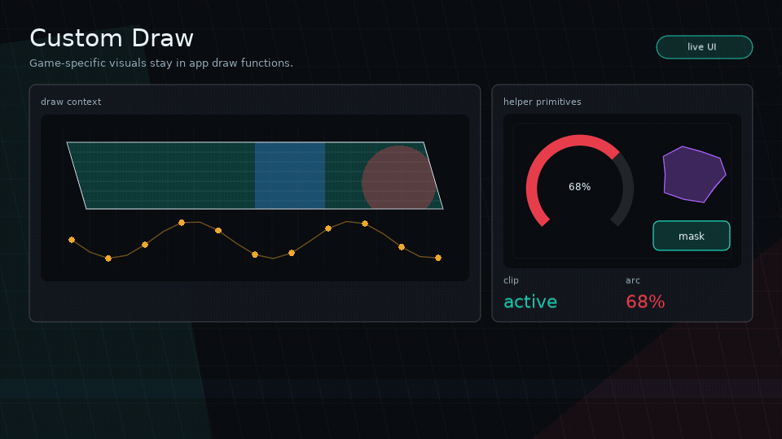

# Custom Draw And Helpers

<!-- glyph:feature-gif custom-draw -->

<!-- /glyph:feature-gif custom-draw -->

Glyph supports custom drawing on any node through `props.draw`.

## Custom Draw Signature

```lua
draw = function(node, x, y, width, height, love, style, ctx)
  -- draw here
end
```

Arguments:

- `node`: current virtual node
- `x`, `y`, `width`, `height`: absolute drawing bounds
- `love`: Love2D module
- `style`: resolved style
- `ctx`: draw helper context

## Draw Context

Useful fields:

- `ctx.node`
- `ctx.props`
- `ctx.x`, `ctx.y`, `ctx.width`, `ctx.height`
- `ctx.love`
- `ctx.graphics`
- `ctx.style`
- `ctx.runtime`
- `ctx.hovered`
- `ctx.pressed`
- `ctx.focused`
- `ctx.active`
- `ctx.hot`
- `ctx.time`

Useful methods:

- `ctx:color(color, alpha)`
- `ctx:rect(mode, x, y, width, height, radius)`
- `ctx:line(...)`
- `ctx:polygon(mode, points)`
- `ctx:shape(mode, shape, bounds?)`
- `ctx:blob(bounds?, opts?)`
- `ctx:clip(shape, fn)`
- `ctx:stencil(shapeOrFn, fn, opts?)`
- `ctx:meter(bounds, opts)`
- `ctx:nineSlice(image, bounds, opts)`
- `ctx:text(value, x, y)`
- `ctx:printf(value, x, y, limit, align)`
- `ctx:pulse(speed, phase)`
- `ctx:skewBox(opts)`

## Example

```lua
ui.box({
  width = 240,
  height = 64,
  style = {
    background = { 0.1, 0.1, 0.14, 1 },
    color = { 0.9, 0.95, 1, 1 },
  },
  draw = function(node, x, y, width, height, love, style, ctx)
    ctx:color(style.background)
    ctx:polygon("fill", ctx:skewBox({ skew = 16 }))
    ctx:color(ctx.hot and { 1, 1, 1, 1 } or style.color)
    ctx:text("COMMAND", x + 18, y + 22)
  end,
})
```

For ordinary images, prefer `ui.image` over custom draw. It handles fit,
alignment, tint, opacity, clipping, and quads:

```lua
ui.image({
  source = portrait,
  width = 96,
  height = 96,
  fit = "cover",
  clip = { kind = "circle" },
  interactive = false,
})
```

Use custom draw when the image itself needs custom shader setup, multi-pass
composition, procedural effects, or app-specific atlas behavior beyond a single
optional quad.

## Shapes And Stencils

Glyph shape descriptors are plain tables:

```lua
{ kind = "rect", radius = 8 }
{ kind = "skew", skew = 18, inset = 2 }
{ kind = "polygon", points = { 0, 0, 140, 10, 120, 64, 8, 56 } }
{ kind = "circle" }
{ kind = "ellipse" }
{ kind = "blob", points = 10, variance = 0.16, seed = "play-button" }
```

Polygon points are local to the node bounds unless `absolute = true` is set.
Shape functions may also return local points or a mask/draw function when a shape
needs animation or custom geometry.

Use `clip` to mask children visually:

```lua
ui.stack({
  width = 220,
  height = 120,
  clip = { kind = "skew", skew = 24 },
}, {
  ui.box({
    position = "absolute",
    inset = 0,
    interactive = false,
    draw = drawAnimatedBackground,
  }),
  ui.text("MASKED PANEL", { x = 16, y = 16 }),
})
```

Use `stencil` when you want explicit inside/outside masking:

```lua
ui.box({
  width = 160,
  height = 160,
  stencil = {
    shape = { kind = "circle" },
    mode = "inside",
  },
}, {
  portraitNode,
})
```

> [!NOTE]
> `clip` and `stencil` are visual-only. Layout and hit testing still use the node's
> rectangular bounds.

Inside custom draw callbacks, use the same primitives:

```lua
draw = function(_, x, y, width, height, love, style, ctx)
  ctx:clip({ kind = "skew", skew = 18 }, function()
    ctx:color(style.background)
    ctx:rect("fill", x, y, width, height)
    ctx:meter({ x = x + 16, y = y + height - 22, width = width - 32, height = 10 }, {
      value = 72,
      max = 100,
      shape = { kind = "skew", skew = 8 },
      fillStyle = { background = { 0.1, 0.9, 0.55, 1 } },
    })
  end)
end
```

`ctx:blob(bounds, opts)` returns deterministic polygon points for organic
buttons, panels, masks, and meters:

```lua
draw = function(_, x, y, width, height, love, style, ctx)
  local shape = {
    kind = "blob",
    points = 12,
    variance = 0.18,
    seed = "launch",
    phase = ctx.time,
  }

  ctx:clip(shape, function()
    ctx:color(style.background)
    ctx:rect("fill", x, y, width, height)
  end)

  ctx:color(ctx.focused and { 1, 0.9, 0.2, 1 } or style.borderColor)
  ctx:shape("line", shape)
end
```

Blob, stencil, shader, particle, and splat-style visuals are usually app or
example code. Keep the core primitive generic, then layer the visual identity in
custom draw and feedback sequences.

## Nine-Slice Frames

Use `ctx:nineSlice` when a Love2D image should scale like a game UI frame,
window, tooltip, or item slot. Glyph draws the nine patches and caches the quads;
the artwork and style still belong to the app.

```lua
ui.box({
  width = 320,
  height = 180,
  draw = function(_, x, y, width, height, love, style, ctx)
    ctx:nineSlice(frameImage, {
      x = x,
      y = y,
      width = width,
      height = height,
    }, {
      border = { left = 12, right = 12, top = 14, bottom = 14 },
      tint = { 1, 0.92, 0.72, 1 },
      opacity = style.opacity,
    })
  end,
}, content)
```

Pass `border = 8` for an even border, or `center = false` to draw only the
frame. V1 stretches edges and center patches; tiled/repeated edges are left to
app-specific custom draw.

## Public Helper APIs

- `ui.isHovered(node)`
- `ui.isPressed(node)`
- `ui.isFocused(node)`
- `ui.isActive(node)`
- `ui.isHot(node)`
- `ui.mix(a, b, t)`
- `ui.mixColor(a, b, t)`
- `ui.setColor(loveModule, color, alpha)`
- `ui.time()`
- `ui.pulse(speed, phase)`
- `ui.polygonBox(x, y, width, height, opts)`
- `ui.meter(props)`
- `ui.customButton(props)`

## Core Boundary

Use custom draw for game-specific UI. If a widget is visually specific to one game or example, keep it out of core and build it from primitives.
