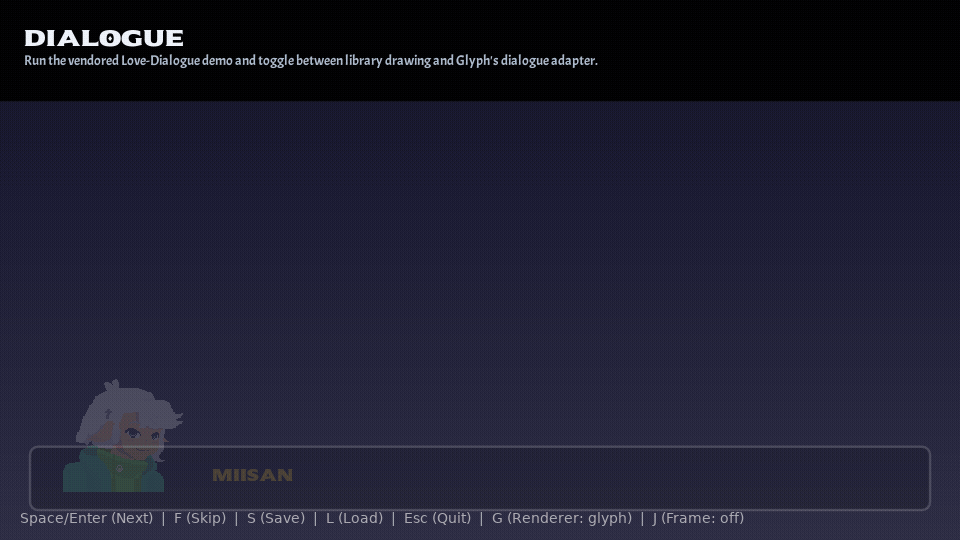

# Dialogue Adapter

<!-- glyph:feature-gif dialogue -->

<!-- /glyph:feature-gif dialogue -->

`ui.dialogue` is an optional adapter for the
[Miisan-png/Love-Dialogue](https://github.com/Miisan-png/Love-Dialogue) dialogue
engine. Love-Dialogue stays app-provided and keeps doing what it is good at —
parsing `.ld` scripts, running logic/choices/variables, audio, and save/load.
The adapter is a thin **render + input bridge**: it reads a normalized model
from a Love-Dialogue instance and draws the dialogue box, typewriter text,
inline effects, and choices with Glyph primitives, so the dialogue becomes
themeable, responsive, and mouse/keyboard interactive.

Glyph does not own dialogue parsing, branching, audio, or save state. The
adapter renders; the library remains the source of truth.

## Setup

```lua
local ui = require("glyph")
local LoveDialogue = require("LoveDialogue") -- app-provided

local dialogue = ui.dialogue.new({ library = LoveDialogue })
dialogue:play("scripts/intro.ld")            -- starts a renderless instance
```

`new` accepts `{ library, instance?, onSignal?, font? }`. Use `:play(path,
config)` to start a new instance (the adapter forces `config.renderless = true`
so the library skips its own drawing), or `:wrap(instance)` to attach an
instance you created yourself.

## Game loop

```lua
function love.update(dt)
  dialogue:update(dt) -- forwards to the instance and advances the effect clock
  ui.update(dt)
end

function love.keypressed(key)
  dialogue:keypressed(key) -- next / choose / skip flow through the library
end
```

Render the box as part of your Glyph tree. `component` returns a positioned node
(or `nil` when no line is active):

```lua
ui.render(function()
  return ui.stack({ width = "100%", height = "100%" }, {
    -- ... your scene ...
    dialogue:component({ height = 220, margin = 28 }),
  })
end)
```

Choices are real Glyph buttons: clicking one calls `select` + `advance`, while
keyboard up/down/enter still flow through `keypressed`, so the highlighted
choice stays consistent across mouse and keyboard per Glyph's input rules.

## The render model

The adapter prefers a `renderModel()` method on the instance and otherwise reads
`dialogue.state`, so it works against a stock upstream copy too. The model:

```lua
{
  active, status, opacity,
  speaker = { name, color },
  text = { full, shown, waiting }, -- shown is the typewriter-revealed prefix
  effects,                          -- parsed inline effect spans
  portrait,                         -- current character portrait, or nil
  transition,                       -- active full-screen fade, or nil
  choiceMode, selectedChoice,
  choices = { { text, target, effects } },
}
```

Read it directly with `dialogue:model()` if you want to render a fully custom
box instead of using `component`.

## Portraits

When the active character has a portrait (defined with `@atlas`/`@rect`,
`@sheet`/`@frame`, or `@portrait` in the script) and `portraitEnabled` is not
`false`, `model.portrait` carries the love `Image`, the `quad` region, the native
size, the configured `portraitSize`, `flipH`, and the character transform
(`scale`, `rotation`, `offsetX`, `offsetY`). `component` draws it bottom-left of
the box and lays the text out beside it (the same place Love-Dialogue's own
renderer puts it). The expression follows `currentExpression`, falling back to
`Default`.

Anchor the portrait vertically with the `portraitAlign` option:

```lua
ui.dialogue.new({ library = LoveDialogue, portraitAlign = "top" }) -- "bottom" (default) | "top" | "center"
```

### Overflow vs. fit

The portrait is drawn at its `portraitSize`. When that is larger than the box's
content height, the portrait extends past the box edge — the "character bust
rising above the textbox" look (and what Love-Dialogue itself does with a short
box). To keep it inside the box instead, set `portraitFit = true` (scales the
portrait down to the box height), or override the size with `portraitSize`:

```lua
ui.dialogue.new({
  library = LoveDialogue,
  portraitFit = true, -- never spill past the box
  portraitSize = 96,  -- or just draw it smaller
})
```

You can also raise the box `height` so the full-size portrait fits.

### Texture filter

Pixel-art portraits usually want nearest-neighbour scaling so they stay crisp
when popped/scaled, while higher-res art wants linear. Set the texture's scaling
filter with `portraitFilter` (or per standalone portrait with `filter`):

```lua
ui.dialogue.new({
  library = LoveDialogue,
  portraitFilter = "nearest", -- "nearest" (pixelated) | "linear" (smooth)
})
```

It calls `Image:setFilter(filter, filter)` on the portrait image before drawing,
so it overrides `love.graphics.setDefaultFilter` for the portrait only. Omit it
to keep whatever filter the image already has.

### Animated size

The drawn size is `portraitSize × scale × pop`:

- **Character transform** — the portrait honors `char.scale` (and `rotation`,
  `x`/`y`), so any animation Love-Dialogue tweens onto the character, or that your
  code sets, animates the portrait.
- **Pop on change** — when the speaker or expression changes, `component` scales
  the portrait up from a smaller value with an ease-out-back overshoot, around its
  bottom-center. It is on by default; tune or disable it with the `portraitPop`
  option:

```lua
local dialogue = ui.dialogue.new({
  library = LoveDialogue,
  portraitPop = { duration = 0.22, from = 0.8 }, -- or false to disable
})
```

The pop is driven by the adapter's clock, so call `dialogue:update(dt)` each
frame.

### Side, frame & mask

```lua
ui.dialogue.new({
  library = LoveDialogue,
  portraitSide = "right",     -- "left" (default) | "right"; auto-mirrors on the right
  portraitFlip = true,        -- force the mirror (default: auto from side)
  portraitFrame = {           -- frame drawn behind the portrait...
    background = { 0, 0, 0, 0.5 }, borderColor = { 1, 1, 1, 0.4 }, borderWidth = 2, radius = 8,
  },
  portraitStencil = { kind = "circle" }, -- ...and a mask on the image
})
```

`portraitFrame` (and the box `frame`) accept a **style table** like above, a
**nine-slice** table `{ image = myImage }` (drawn with `ctx:nineSlice`), or a
**draw function** `function(ctx, x, y, w, h, love, opacity) … end`.
`portraitStencil` accepts a `GlyphShape` (e.g. `{ kind = "circle" }`) or a
function, applied with `ctx:stencil` to mask the image.

The **speaker name** sits on top of the body text and follows the text alignment
(`textAlign`), so right-aligned text puts the name at the top-right (next to a
right-side portrait). Per-line side is just `component({ portrait = "left"|"right" })`
— for a two-sided conversation, drive it from `dialogue:model().speaker.name`:

```lua
local m = dialogue:model()
local side = (m and m.speaker.name == "Wiisan") and "right" or "left"
dialogue:component({ portrait = side, textAlign = side }) -- portrait + name + text on that side
```

`textAlign` (`"left"` | `"center"` | `"right"`, default `opts.textAlign`) aligns
the body text — handy to right-align a right-side speaker. (`align` is still
accepted as a back-compat alias.)

### Portrait outside the box

For a bust on top of the box (or anywhere), drop the inline portrait and place a
standalone one with `dialogue:portrait(props)` — it returns a node (or `nil`):

```lua
ui.stack({ width = "100%", height = "100%" }, {
  dialogue:portrait({
    width = 120, height = 180,
    layout = { position = "absolute", left = 40, bottom = 150, zIndex = 14 },
    frame = { image = panelImage }, -- its own nine-slice panel
    stencil = { kind = "circle" },
  }),
  dialogue:component({ portrait = false }), -- box without the inline portrait
})
```

#### Anchor the bust above the box (pushed up by growth)

To keep the bust a **fixed size** and have the growing box *push it up* (instead
of resizing it), compose it in a bottom-anchored column with `component({ flow =
true })` — `flow` returns the box as a normal flow node instead of an absolutely
positioned bar, so the layout does the anchoring automatically:

```lua
ui.column({ position = "absolute", left = 24, right = 24, bottom = 24, gap = 0 }, {
  ui.row({ width = "100%", justify = "end" }, {
    ui.stack({ width = 150, height = 150 }, {
      dialogue:portrait({ width = "100%", height = "100%", stencil = { kind = "circle" } }),
      ui.box({ position = "absolute", inset = 0, draw = ringDraw }), -- ring on top
    }),
  }),
  dialogue:component({ portrait = false, flow = true }), -- box below; growth lifts the bust
})
```

As the box grows to fit choices/long text, the column grows upward (bottom is
fixed) and the bust rises with it — its size never changes.

## Custom box frame

The box border is customizable inline via `style`:

```lua
dialogue:component({ style = { borderColor = { 1, 0.8, 0.2, 1 }, borderWidth = 3, radius = 12 } })
```

For a richer frame (a painted UI-kit panel or your own draw), pass `frame` — a
nine-slice table, a style table, or a draw function. It replaces the default
border and is drawn behind the content:

```lua
dialogue:component({ frame = { image = boxFrameImage, opts = { border = 16 } } })
-- or: frame = function(ctx, x, y, w, h) ctx:nineSlice(myImage, { x = x, y = y, width = w, height = h }) end
```

## Inline text effects

`component` custom-draws `text.shown` per glyph and applies Love-Dialogue's
inline effects (`{wave}`, `{shake}`, `{jiggle}`, `{color:RRGGBB}`, `{italic}`,
`{bold}`) using offsets equivalent to the library's own `TextEffects`. The effect
math lives in the adapter, so it needs no access to the library's internal modules.

> [!NOTE]
> `{bold}` is faux bold — each glyph is drawn a few times at sub-pixel offsets to
> thicken it (the same trick Love-Dialogue uses), so it works with any font but
> looks heavier/softer than a real bold typeface. For crisp bold, render a custom
> box from `dialogue:model()` with an actual bold `Font`.

## Box height

By default the box height animates (driven by `dialogue:update(dt)`):

- **Fit the text** — `height` is a *minimum*; the box grows when a line wraps to
  more lines than the base allows, so long text is never clipped. (The body text
  is custom-drawn for the inline effects, so the adapter measures the wrapped
  height itself.)
- **Grow for choices** — it also grows to fit the choice buttons when choices
  appear, then shrinks back.
- **Expand in / collapse out** — the box expands up from the bottom when a line
  appears and collapses while it fades out.

```lua
ui.dialogue.new({
  library = LoveDialogue,
  height = 130,          -- base text-area height (smaller = shorter box)
  choiceHeight = 30,     -- how much each choice grows the box (and the button height)
  maxHeight = 300,       -- optional clamp so it never grows past this
  animateHeight = false, -- opt out entirely: fixed height
})
```

Total grown height is roughly `height + #choices × (choiceHeight + 4)`, clamped to
`maxHeight`. So lower `height` for a shorter box overall, lower `choiceHeight` to
make it grow less per choice, and set `maxHeight` to cap it. With
`animateHeight = false` the box stays a fixed `height` (or the per-call
`component({ height = ... })`).

## Fade transitions

Scripts can run full-screen fades with `[fade: out 1.0]` / `[fade: in 1.0 #FFFFFF]`.
The library draws those itself in library mode; since the adapter replaces its
drawing, render them with `dialogue:overlay()` — a full-screen node (or `nil`
when no fade is active) that you place on top of your scene:

```lua
ui.render(function()
  return ui.stack({ width = "100%", height = "100%" }, {
    -- ... scene + dialogue:component(...) ...
    dialogue:overlay({ zIndex = 50 }), -- covers the screen during a fade
  })
end)
```

The fade alpha and color come from `model.transition`; the library advances them
during `dialogue:update(dt)`.

## Runtime augmentation

The adapter does not require any changes to Love-Dialogue. When you `wrap` (or
`play`) an instance, the adapter adds the methods it needs **to that instance at
runtime**, leaving the library source untouched:

- `instance:renderModel()` — the normalized model above (added if missing).
- `instance:selectChoice(index)` — clamp and set the highlighted choice.
- `instance:isFinished()` — `not state.isActive`.
- A renderless-aware `draw` wrapper — when `instance.config.renderless` is set,
  the library's own `:draw()` becomes a no-op so the adapter owns drawing.

Each method is only added when absent, so an upstream copy that already provides
its own keeps it. The adapter therefore needs no library edits; the vendored
`examples/dialogue` snapshot carries only one small, documented gameplay patch
(sequential `[move:]`) — see `vendor/LOVE_DIALOGUE_NOTICE.md`.

## Example

`examples/dialogue` runs the faithful upstream Love-Dialogue demo and adds a `G`
key that toggles between **library-drawn** (Love-Dialogue's own box) and
**glyph-drawn** (`ui.dialogue`) rendering of the same running conversation.
