# Examples

Run examples with Love2D:

```sh
love examples/accessibility
love examples/animations
love examples/audio-cues
love examples/basic
love examples/dashboard
love examples/hud-menu
love examples/hud-primitives
love examples/i18n
love examples/juice
love examples/modal
love examples/navigate
love examples/scene
love examples/showcase
love examples/styles
love examples/themes
love examples/typography
love examples/viewport
love examples/performance
```

Generate documentation GIFs from the dedicated capture scenes:

```sh
make docs-gifs
make docs-gifs FEATURE=animations
```

The command requires Love2D and FFmpeg. Set `LOVE_BIN` or `FFMPEG_BIN` when the
executables are not on `PATH`; on macOS the script also checks
`/Applications/love.app/Contents/MacOS/love`.

## Accessibility

Love2D-friendly semantics demo with keyboard/gamepad focus traversal, localized labels, live region events, hidden decoration, semantic snapshots, and a fake TTS/log adapter.

## Animations

Flux-backed animation lab for declarative show/hide, animated meters, custom-drawn movement, selection feedback, and size tweens.

## Audio Cues

Theme and variant driven interaction cue events with app-owned Love2D tone playback, per-node overrides, and silent controls.

## Basic

Minimal component, state, button, input, and scroll usage.

## Dashboard

A dense shadcn-inspired dashboard translated into Glyph primitives. Useful for panels, metric cards, chart drawing, filters, tabs-style controls, and scrollable tables.

## HUD Menu

Custom-drawn game UI with animated command buttons. This example demonstrates what belongs in app/example code rather than Glyph core.

## HUD Primitives

Native meters, filled sweep gauges with centered overlays, d-pad/card navigation, `ui.image` portraits, shape descriptors, visual clipping, stencil masks, and dynamic backgrounds for game HUDs without adding game-specific core widgets.

## I18n

Responsive game-console localization demo with locale switching, keyed command/status UI, meters, tabs, fallback text, cached parameter translations, and `ui.i18n.version()` in memo deps.

## Juice

Pattern-repeat mini game built from normal Glyph buttons, with press/release/activate feedback, click-position particles, ripples, screen shake, generated audio tones, keyboard and d-pad navigation, progress meters, and a scoped pause menu.

## Navigate

Arrow key and d-pad spatial navigation across a denser game-tool layout. Demonstrates
`ui.navigate`, beam-aware movement, `navGroup` scoping, trapped `navScope` submenus, focus
visibility, gamepad d-pad forwarding, and shader-backed JRPG command submenus.

## Modal

Scene-backed modals, moving background, shader transitions, stencil/blob transition implemented outside core, isolated modal hook state, and backdrop dismissal.

## Scene

Scene replacement, non-blocking debug overlays, blocking pause modal, modal-driven pause behavior, and scene-local motion.

## Showcase

A combined runnable app that keeps the standalone examples unchanged while
mounting their shared example modules into one scene-driven app. Use it to resize
one window and compare how the real demos adapt.

## Styles

Theme switching, variants, state styles, transitions, custom draw, and shader-backed styling.

## Themes

A full-screen game-tool HUD showing four theme presets, live radius/border/density/accent token controls, component variants, inputs, tabs, meters, and themed scrollbars.

## Typography

Responsive typography lab showing theme font registries, text presets, live text scale, optional SYSL-backed rich text, localized formatted copy, and normal components using typography tokens.

## Viewport

Fixed virtual-resolution rendering with backend-agnostic Push/Shove adapters, scaled pointer input, fit/filter controls, scrolling, and modal rendering.

This demo uses development copies of Push and Shove from `dev/vendor`; Glyph apps should install or provide their own viewport backend.

## Performance

Large dataset workflow with a visible window of mounted rows, static row reuse, and timing display.


<!-- glyph:feature-gif-gallery -->
## Feature GIF Gallery

| Feature | Preview |
| --- | --- |
| [Getting Started](getting-started.md) | 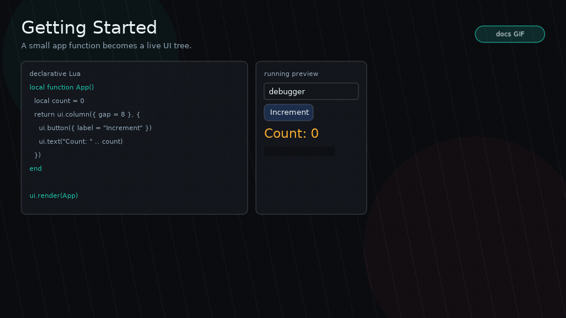 |
| [Components](components.md) |  |
| [Layout](layout.md) | 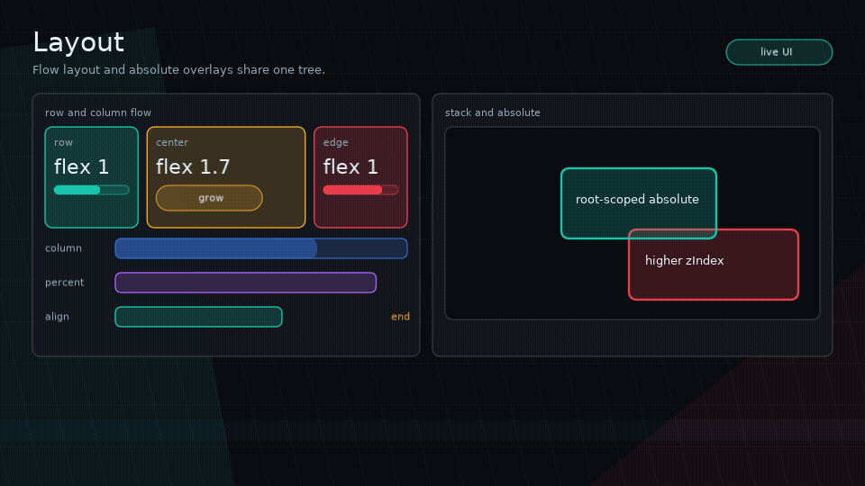 |
| [Styling And Themes](styling.md) | 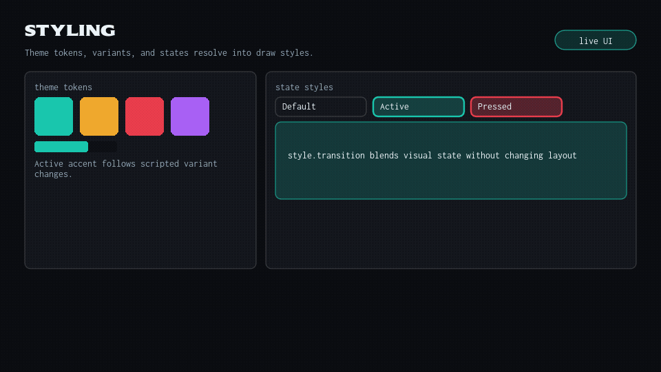 |
| [Runtime, Hooks, And Events](runtime.md) | 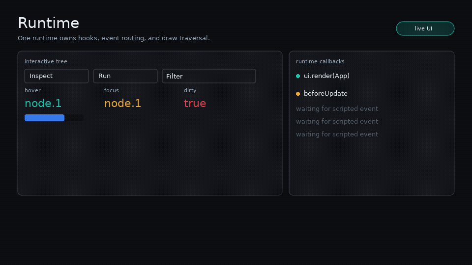 |
| [Callback Bus](callback-bus.md) | 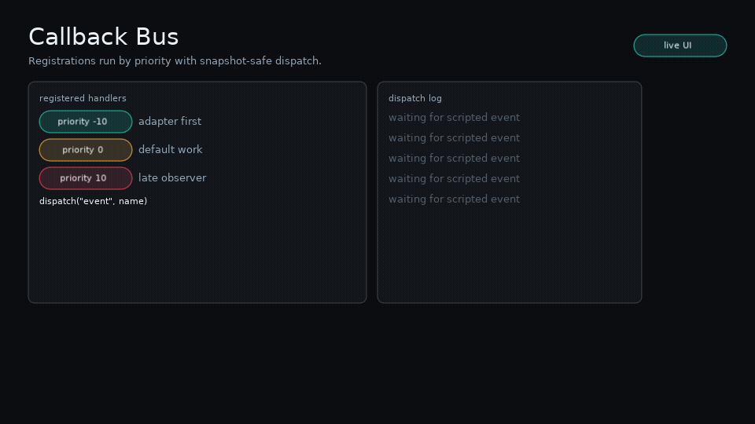 |
| [I18n](i18n.md) | 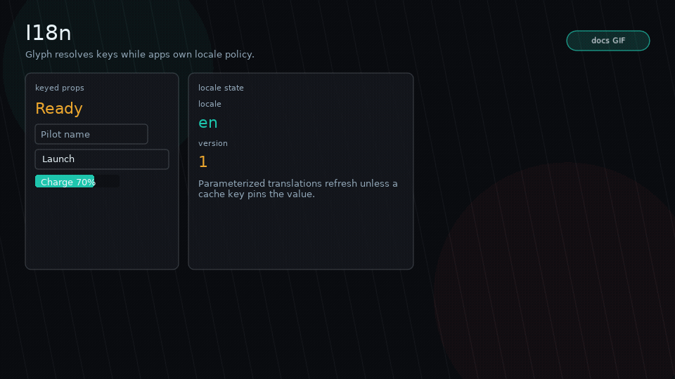 |
| [Accessibility](accessibility.md) | 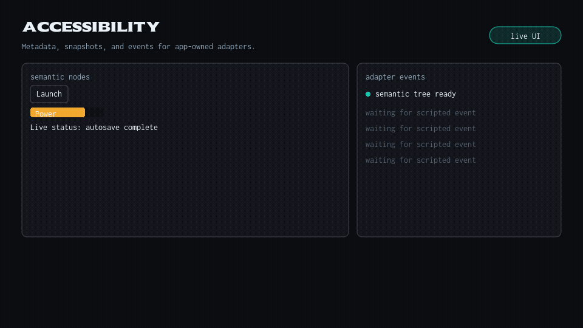 |
| [Responsive Helpers](responsive.md) | 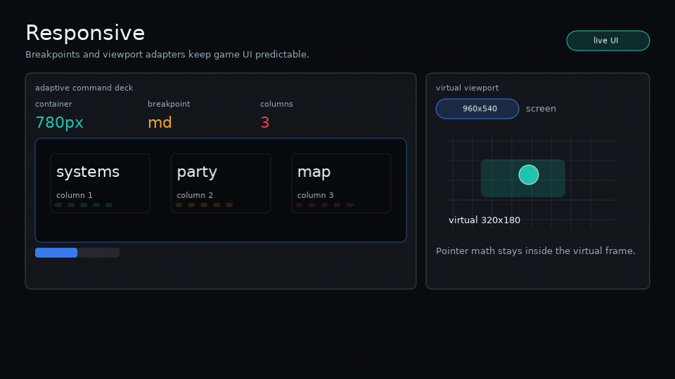 |
| [Custom Draw And Helpers](custom-draw.md) |  |
| [Animations](animations.md) | 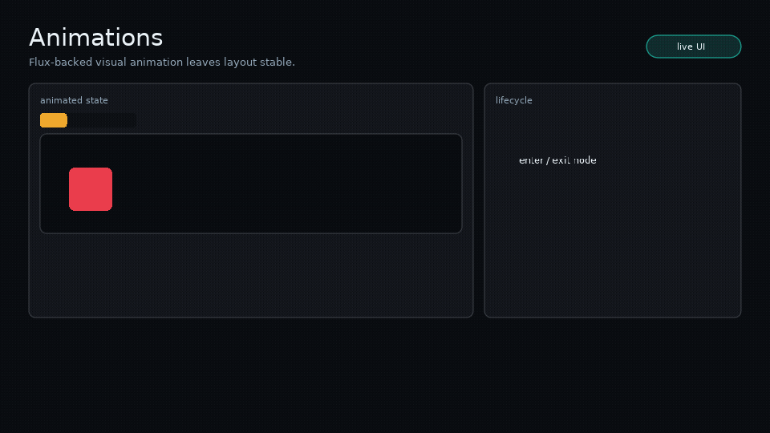 |
| [Feedback](feedback.md) | 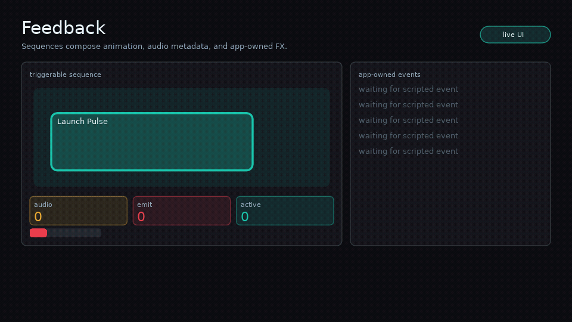 |
| [Scenes And Modals](scenes-and-modals.md) | 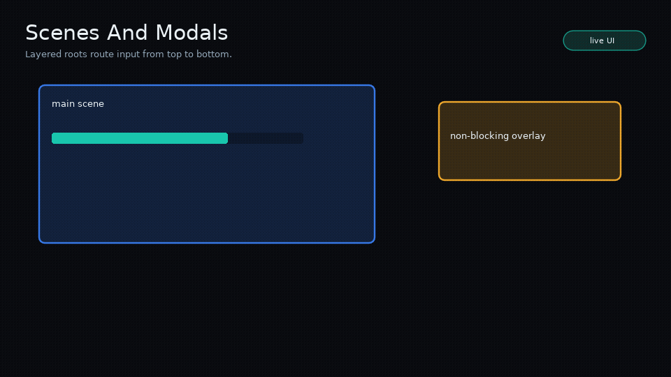 |
| [Transitions](transitions.md) | 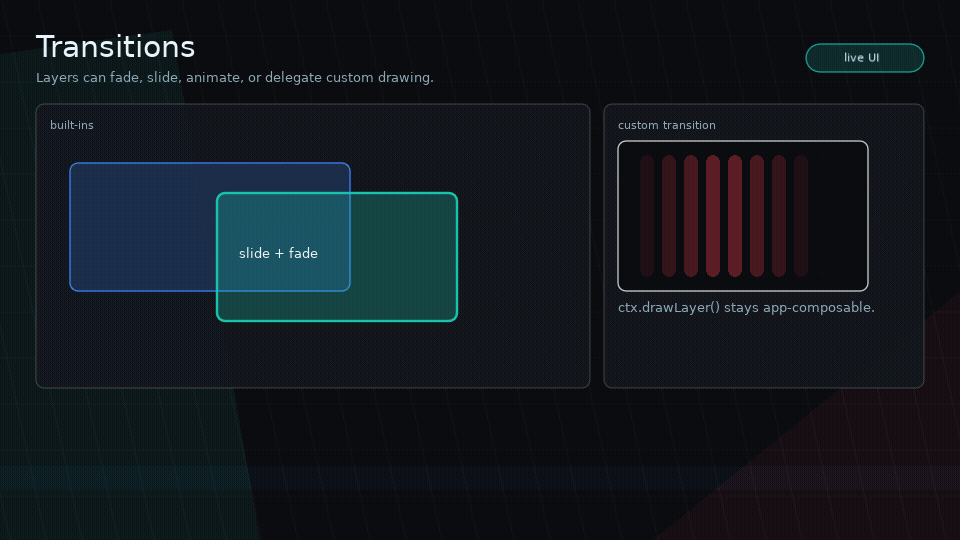 |
| [Spatial Navigation](navigation.md) | 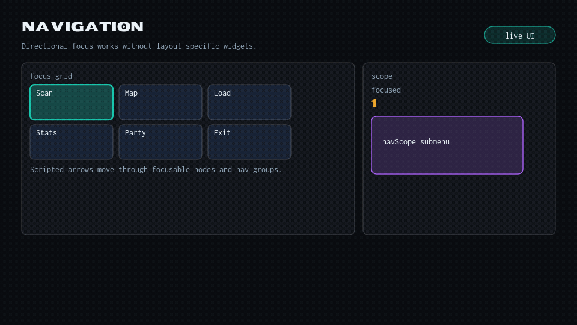 |
| [Performance](performance.md) | 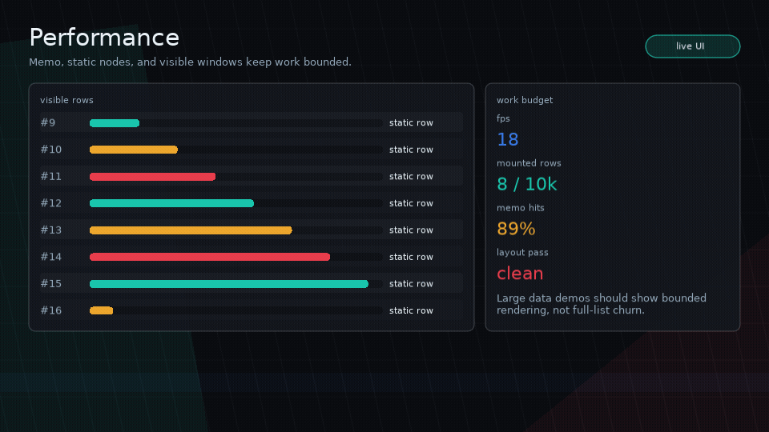 |
<!-- /glyph:feature-gif-gallery -->

## Example Standards

Examples should show real UI workflows:

- Prefer usable screens over landing pages.
- Use Glyph primitives honestly.
- Keep game-specific visuals in examples, not core.
- Make interaction states visible.
- Keep examples runnable with `love examples/name`.
