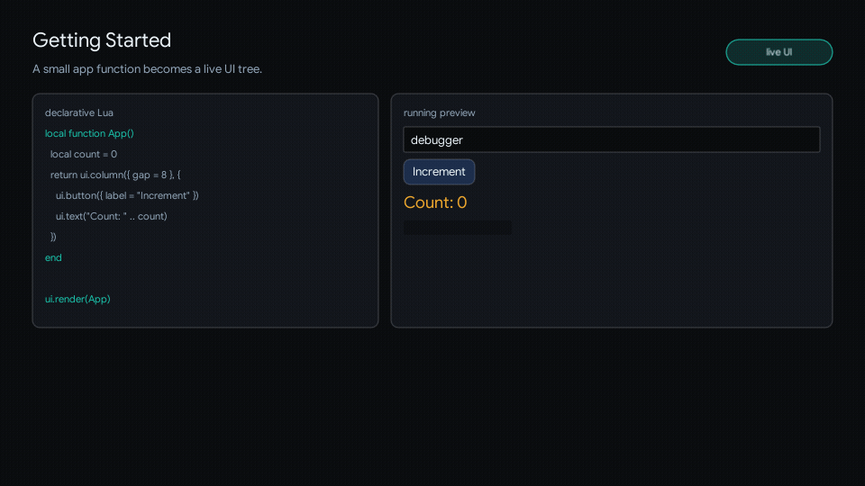

# Getting Started

<!-- glyph:feature-gif getting-started -->

<!-- /glyph:feature-gif getting-started -->

Create a `main.lua` in the Love2D project where you installed Glyph:

```lua
local ui = require("glyph")

local function App()
  local count, setCount = ui.useState(0)

  return ui.column({ gap = 8, padding = 12 }, {
    ui.text("Feather Debugger"),
    ui.button({
      label = "Increment",
      onClick = function()
        setCount(count + 1)
      end,
    }),
    ui.text("Count: " .. tostring(count)),
  })
end

function love.load()
  ui.load({
    window = {
      width = 928,
      height = 720,
      resizable = true,
      title = "Glyph App",
    },
    app = App,
  })
end
```

Run the project with `love .`. The button should increment the count.

Passing `app = App` to `ui.load` installs update, draw, pointer, keyboard,
touch, wheel, and resize callbacks. This is the recommended first-run setup.

## Manual Wiring

If your game owns its Love2D callbacks, do not call `ui.load` or `ui.install`.
Forward the runtime callbacks your UI uses:

```lua
function love.update(dt)
  ui.update(dt)
end

function love.draw()
  ui.render(App)
end

function love.mousemoved(x, y, dx, dy)
  ui.mousemoved(x, y, dx, dy)
end

function love.mousepressed(x, y, button)
  ui.mousepressed(x, y, button)
end

function love.mousereleased(x, y, button)
  ui.mousereleased(x, y, button)
end
```

The manual path uses the global `love` module automatically. If you prefer
Glyph to chain common input callbacks while your game keeps update and draw,
call `ui.install(love)` and remove the manual input forwarders. Do not combine
manual `ui.update` / `ui.render` calls with `ui.load({ app = App })`.

## Next Steps

- [Architecture & Mental Model](architecture.md) explains rendering, state, and identity.
- [Components](components.md) covers buttons, inputs, lists, tabs, and panels.
- [Layout](layout.md) covers rows, columns, grids, stacks, and positioning.
- [Styling And Themes](styling.md) covers visual styles and interaction states.
- [Navigation](navigation.md) adds keyboard and controller focus.
- [Scenes And Modals](scenes-and-modals.md) adds layered game UI.
