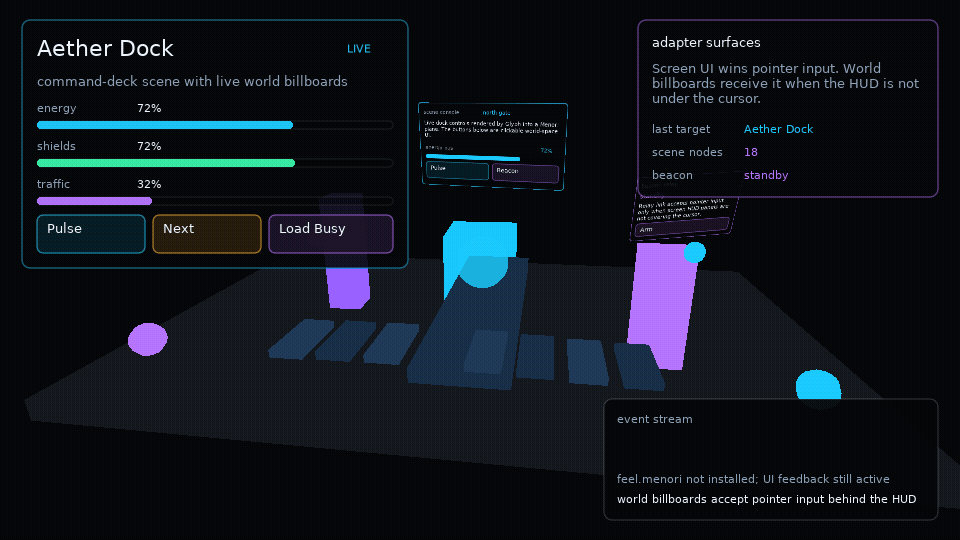

# Menori Adapter

<!-- glyph:feature-gif menori -->

<!-- /glyph:feature-gif menori -->

`ui.menori` is an optional adapter for [rozenmad/Menori](https://github.com/rozenmad/Menori). Menori stays app-provided; Glyph provides scene-layer glue, loading overlays, transitions, screen-space overlays, and interactive world-space UI surfaces.

## Setup

```lua
local ui = require("glyph")
local menori = require("menori")

local adapter = ui.menori.new({
  menori = menori,
  environment = environment,
})
```

If `feel.menori` is available, the adapter reports it through `adapter.capabilities.feelMenori` and can create a Feel Menori adapter:

```lua
local menorifx = adapter:feelAdapter({ environment = environment })
```

Glyph checks passed modules first, then `glyph.vendor.feel.menori`, then external `feel.menori`. Menori and Feel remain optional dependencies.

> [!NOTE]
> The `examples/menori` demo vendors a Menori snapshot under `examples/menori/vendor`
> so `make menori` can run without a separate Menori install. Glyph core still does
> not vendor or require Menori; apps pass their own module to `ui.menori.new`.

## Menori Scenes

Use `adapter:view` when a Menori scene should live inside a Glyph layout region:

```lua
adapter:view({
  width = "100%",
  height = "100%",
  scene = scene,
  root = rootNode,
  environment = environment,
  renderStates = {
    node_sort_comp = menori.Scene.layer_comp,
  },
  overlay = function()
    return ui.button({ label = "Pulse", onClick = pulse })
  end,
})
```

Use `adapter.scene` when Menori content is the current scene layer:

```lua
adapter.scene.set("world", {
  scene = scene,
  root = rootNode,
  environment = environment,
  update = function(spec, layer, dt)
    cameraTarget.values.yaw = cameraTarget.values.yaw + dt * 0.2
  end,
})
```

`adapter.scene.replace` uses a Menori-aware crossfade transition by default when a previous view canvas is available.

## Loading Overlays

`adapter.loading.open` creates a Glyph scene layer for progress UI. Loading work is still app-owned.

```lua
local loading = adapter.loading.open("loading", {
  progress = 0,
  message = "Loading realm",
  detail = "streaming materials",
})

loading:update({ progress = 0.65, detail = "building world UI" })
loading:close()
```

## Billboards

`adapter:billboard` renders a scoped Glyph surface into a Menori plane material. The surface has its own runtime, hooks, focus, feedback, and drag state.

```lua
adapter:billboard({
  parent = rootNode,
  environment = environment,
  x = 0,
  y = 1.4,
  z = -0.6,
  width = 260,
  height = 120,
  worldWidth = 1.5,
  inputPriority = "behind-ui",
  component = function(worldUi)
    return worldUi.button({
      label = "Open",
      width = 260,
      height = 64,
      onClick = openPanel,
    })
  end,
})
```

By default, screen-space Glyph UI wins input. Use `inputPriority = "always"` for billboards that should receive pointer input even under a HUD. V1 tests registered UI planes only; it does not perform mesh occlusion or physics picking.

## Surfaces

`ui.surface.new` is the generic helper behind billboards. It renders Glyph into an offscreen canvas and exposes local input methods:

```lua
local surface = ui.surface.new({
  width = 320,
  height = 180,
  component = function(surfaceUi)
    return surfaceUi.panel({ title = "Terminal" }, {
      surfaceUi.text("independent runtime"),
    })
  end,
})

surface:update(dt)
surface:render()
surface:mousepressed(24, 32, 1)
```

Use surfaces for world UI, render-to-texture panels, minimap labels, or any app-owned draw path that needs a real Glyph runtime outside the main screen tree.
