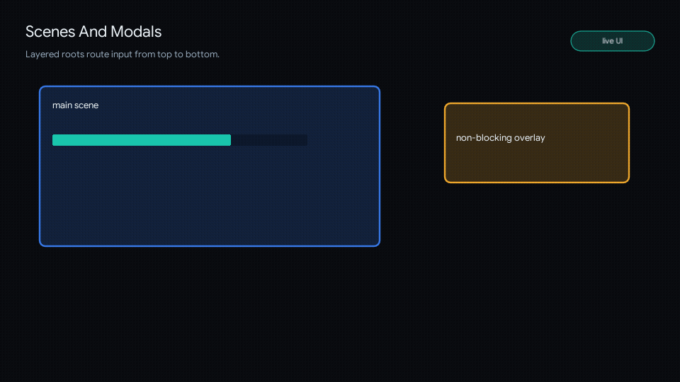

# Scenes And Modals

<!-- glyph:feature-gif scenes-modals -->

<!-- /glyph:feature-gif scenes-modals -->

> [!TIP]
> See it in action: [`examples/scene`](examples.md) and
> [`examples/modal`](examples.md) demonstrate the stack, layers, and overlays.

Glyph provides a native scene/layer stack. Scenes, overlays, and modals use one stack model, one transition pipeline, one input router, and isolated hook scopes.

## Scene API

```lua
ui.scene.set(id, component, opts)
ui.scene.push(id, component, opts)
ui.scene.pop(idOrNil)
ui.scene.close(id)
ui.scene.clear(predicateOrNil)
ui.scene.current()
ui.scene.isOpen(id)
ui.scene.layers()
```

## Layer Options

Common options:

- `kind = "scene" | "modal" | "overlay"`
- `blocking`
- `input`
- `backdrop`
- `backdropColor`
- `dismissOnBackdrop`
- `escapeToClose`
- `width`, `height`
- `align`
- `zIndex`
- `props`
- `transition`
- `duration`
- `exitDuration`
- `onEnter`
- `onExit`
- `onClose`
- `onUpdate`
- `onEvent`

## Main Scene

```lua
ui.scene.set("home", HomeScene, {
  transition = "none",
})
```

## Overlay

```lua
ui.scene.push("debug", DebugOverlay, {
  kind = "overlay",
  blocking = false,
  input = false,
  transition = "fade",
})
```

Non-blocking overlays allow lower layers to keep receiving input.

## Modal

```lua
ui.scene.push("pause", PauseMenu, {
  kind = "modal",
  width = 420,
  height = 260,
  dismissOnBackdrop = true,
  transition = ui.transitions.scale({ duration = 0.18 }),
})
```

## Modal Convenience API

```lua
ui.modal.open("settings", SettingsModal, opts)
ui.modal.close("settings")
ui.modal.closeAll()
ui.modal.isOpen("settings")
```

`ui.modal.open` is a wrapper over `ui.scene.push` with `kind = "modal"`.

## Input Rules

- Layers route input top-down.
- Blocking layers stop input from reaching lower layers.
- Non-blocking overlays can pass input through.
- Backdrop clicks close a layer only when `dismissOnBackdrop = true`.
- Escape closes the top eligible layer unless `escapeToClose = false`.
- A pushed blocking layer suspends keyboard, gamepad, and text input focus below it.
- Closing a layer clears its input targets. When a pushed layer suspended focus,
  Glyph restores the previously focused control after removal if it is still
  reachable.
- Suspension emits a focus-loss event without a focus cue. Successful restoration
  emits the same focus event and cue metadata as an explicit `ui.setFocus` call.

## Hook Isolation

Each scene layer has its own hook scope. `useState` inside a modal does not mutate state in the main scene or another modal.

The layer root is available when its effects run, so an initial `useEffect` may
call `ui.setFocus` for a node captured from that layer's first build.

Closing or clearing a layer retains its hook state and active effects while the
exit transition draws. After the transition and `onClose`, Glyph runs each effect
cleanup once and releases the scope. `ui.scene.set` replaces the whole stack
immediately, and `ui.scene.push` replaces an existing duplicate ID immediately,
so those operations clean up discarded scopes during the call without waiting for
an exit transition.

## Menori Scenes

`ui.menori.new({ menori = menori })` adds optional Menori-aware scene helpers for
3D scene layers, loading overlays, crossfades, and interactive world-space
billboards. Menori remains app-provided.

```lua
local adapter = ui.menori.new({ menori = menori, environment = environment })

adapter.scene.set("world", {
  scene = scene,
  root = rootNode,
  environment = environment,
  overlay = function()
    return ui.button({ label = "Pause" })
  end,
})
```

See [Menori Adapter](menori.md) for the full adapter API.
